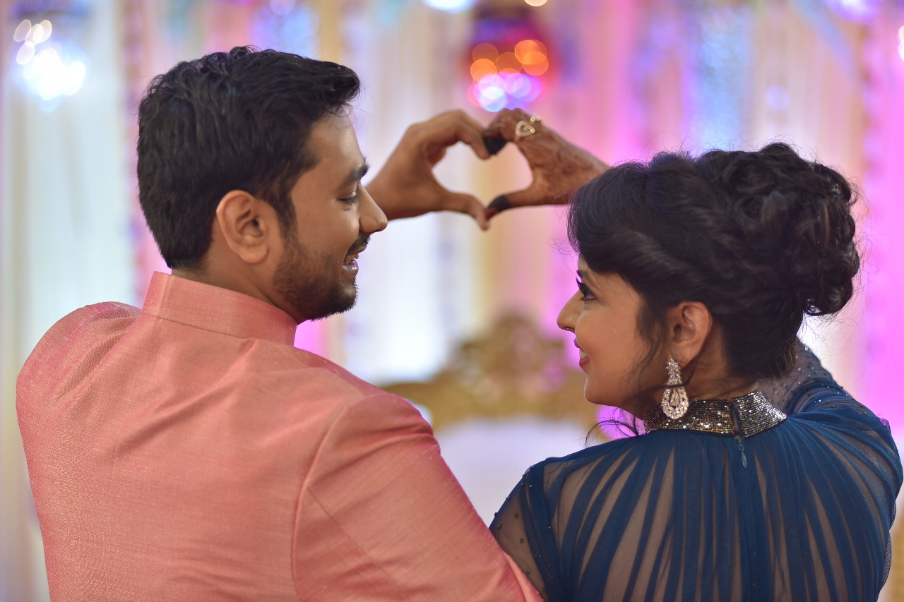

Here are some examples of what a post with images might look like. If you want to display two or three images next to each other responsively use `figure` with the appropriate `class`. Each instance of `figure` is auto-numbered and displayed in the caption.

<figure>
	
</figure>

<figure class="half">
    
    
    <figcaption> Love </figcaption>
</figure>

<figure class="third">
	
	
	
	<figcaption>Three images.</figcaption>
</figure>

### Alternative way

Another way to achieve the same result is to include `gallery` Liquid template. In this case you
don't have to write any HTML tags – just copy a small block of code, adjust the parameters (see below)
and fill the block with any number of links to images. You can mix relative and external links.

Here is the block you might want to use:




	http://vignette2.wikia.nocookie.net/naruto/images/9/97/Hinata.png
	http://vignette4.wikia.nocookie.net/naruto/images/7/79/Hinata_Part_II.png
	http://vignette1.wikia.nocookie.net/naruto/images/1/15/J%C5%ABho_S%C5%8Dshiken.png





Parameters:

- `caption`: Sets the caption under the gallery (see `figcaption` HTML tag above);
- `cols`: Sets the number of columns of the gallery.
Available values: [1..3].

It will look something like this:


	http://vignette2.wikia.nocookie.net/naruto/images/9/97/Hinata.png
	http://vignette4.wikia.nocookie.net/naruto/images/7/79/Hinata_Part_II.png
	http://vignette1.wikia.nocookie.net/naruto/images/1/15/J%C5%ABho_S%C5%8Dshiken.png


